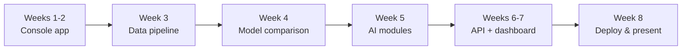

## Prologue

This is the index for an 8-week AI/ML internship, split across five repositories because each one
is a genuinely different kind of work — a console app, a data pipeline, a model comparison, two
AI modules, and the backend/frontend that ties them together. None of them are meant to stand
completely alone; each was written assuming the ones before it already existed. This repo is the
map that shows how.

Every repo below follows the same rule, restated once here instead of five times: **what I was
solving for → what I chose → what I didn't choose, and why not.** If you only read one thing in
each repo, read its decision log — that's where the actual reasoning lives, not just the code.

 

## The arc

Five repos, but really one continuous line: Python fundamentals become an OOP system
*(Weeks 1–2)*, which teaches enough Pandas/NumPy to properly clean a real dataset
*(Week 3)*, which becomes the fixed feature set three models get compared on
*(Week 4)*, which is where the actual capstone's two AI modules are prototyped in
isolation *(Week 5)*, which finally get wired into a live API and a dashboard on top
*(Weeks 6–7)*. Nothing here was built out of order.

 

## Chapter 1 — Learning to structure a program

**[`student-management-system`](https://github.com/HamzaButt22/student-management-system)** ·
Weeks 1–2

Starts as a dictionary-and-a-loop console script, ends as an OOP system with inheritance, JSON
persistence, and a documented README. The point of these two weeks wasn't the student-record
domain — it was learning to structure *any* program: variables → data structures → validation →
control flow → functions/exceptions → classes → inheritance → persistence.

 

## Chapter 2 — Learning to trust a dataset

**[`eda-data-pipeline`](https://github.com/HamzaButt22/eda-data-pipeline)** · Week 3

The first project built against real, messy data instead of hand-typed records: NumPy
fundamentals, then a real Kaggle dataset run through cleaning, scaling, encoding, and
visualization. Every later model in Chapter 3 trains on the dataset this chapter cleaned.

 

## Chapter 3 — Learning that a fair comparison is a design decision

**[`classical-ml-comparison`](https://github.com/HamzaButt22/classical-ml-comparison)** · Week 4

Linear regression, logistic regression, and a decision tree, all trained on the *exact* same
features and split from Chapter 2's dataset. The comparison itself was the exercise — holding
everything constant except the algorithm is what makes the results actually mean something.

 

## Chapter 4 — Learning to build a module, not a script

**[`capstone-ai-modules`](https://github.com/HamzaButt22/capstone-ai-modules)** · Week 5

Two small, independent, testable functions — `analyze_resume()` and `analyze_image()` — built to
the same shape: a file in, a clean result out. Neither knows the other exists. Neither knows yet
that Chapter 5 is about to wrap both of them in a web API.

 

## Chapter 5 — Learning to make it a real, running system

**[`capstone-backend`](https://github.com/HamzaButt22/capstone-backend)** · Weeks 6–7

Chapter 4's two modules get FastAPI endpoints, proper input validation, a SQLite log of every
request, and a Streamlit dashboard on top that talks to the API the same way any external client
would. This is where four weeks of separate practice becomes one thing a person could actually
click through.

 

## Epilogue — Week 8

Deployment, a full written report across all five repos, a rehearsed demo, and logbook sign-off.
No new code — Week 8 is where everything above gets cleaned up, documented consistently, and
handed off. This hub repo is part of that: one place that shows the whole eight weeks as a single
line, not five disconnected folders.

 

**[Chapter 1](https://github.com/HamzaButt22/student-management-system) ·
[Chapter 2](https://github.com/HamzaButt22/eda-data-pipeline) ·
[Chapter 3](https://github.com/HamzaButt22/classical-ml-comparison) ·
[Chapter 4](https://github.com/HamzaButt22/capstone-ai-modules) ·
[Chapter 5](https://github.com/HamzaButt22/capstone-backend)**

# ai-ml-internship
